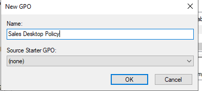
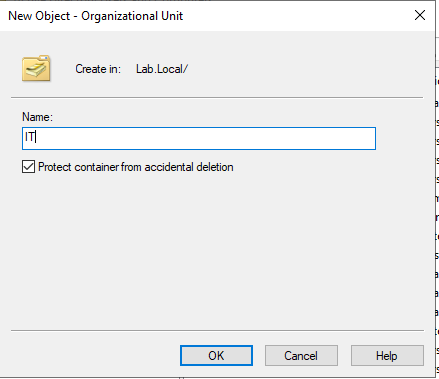
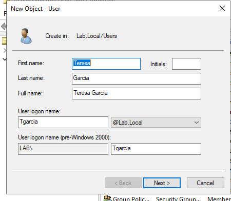
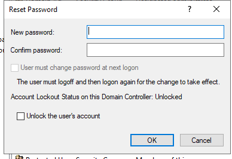
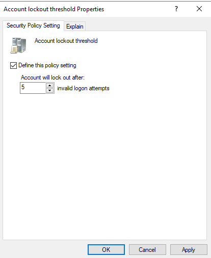
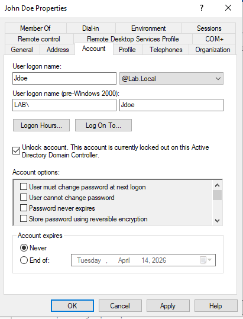

#  Active Directory Home Lab

##  Project Overview
Built a Windows Server Active Directory environment in a virtual lab to simulate real-world IT support tasks.

---

##  What I Did
- Installed Windows Server
- Promoted server to Domain Controller
- Created users, groups, and organizational units (OUs)
- Joined a client machine to the domain
- Configured Group Policy Objects (GPOs)
- Simulated account lockouts and password resets

---

##  Skills Demonstrated
- Active Directory Administration  
- Windows Server  
- User & Group Management  
- Group Policy Configuration  
- Troubleshooting  

---

##  Screenshots

##  Setup Guide
See setup-guide.md for step-by-step instructions
